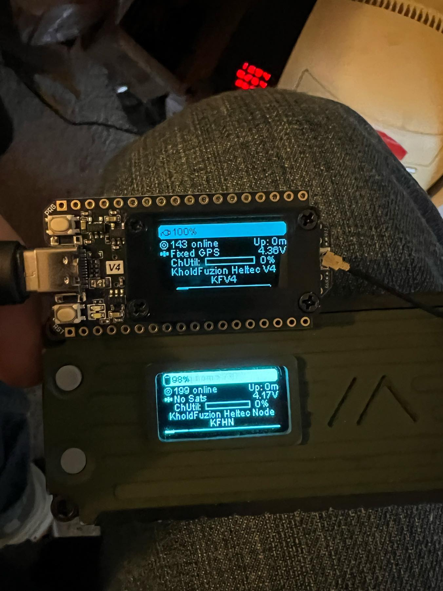

Title: Heltec V4 LoRa 32: First Impressions and Real-World Use
Date: 10.09.2025 10:44
Category: Articles
Tags: meshtastic, lora, heltec, esp32, iot, hardware, review

I've been using the Heltec V4 LoRa 32 Development Board for a little while now, and honestly, it's been a great experience. The first thing I noticed was how fast and responsive it is—every button press and input just works instantly, which makes setting things up way less frustrating.

One feature I really like is the optional WiFi jack on the bottom. It's a clever addition that gives you more options for how and where you use the board, especially if you're tinkering with different cases or setups.

The separate connectors for battery and solar power are also super handy. I haven't had a chance to test the solar port yet, but just knowing it's there has me pondering some off-grid projects in the future. Having dedicated ports for each power source just makes hook-ups so much simpler.

When it comes to actual Meshtastic use, the V4 definitely outperforms the V3 in terms of range. I've noticed my nodes stay connected farther apart, which is awesome for building a reliable mesh network.

Another thing I noticed is the screen brightness. The display is a bit dimmer than I expected—still usable, but if you're planning to use it outdoors or in bright light, it's something to keep in mind. Here's a photo so you can see what I mean:

Overall, I'm really happy with the Heltec V4 so far. It's a solid upgrade with thoughtful hardware improvements, and I'm looking forward to seeing what else it can do as I keep experimenting.

If you're interested, you can check it out here: [Heltec V4 LoRa 32 Development Board on Amazon](https://amzn.to/4nWc4Rn)

*Note: This is an affiliate link. If you use it, it helps me out at no extra cost to you.*

And no, I haven’t forgotten about the Seeed Solar Node followup! The node is all set and just waiting for AD3i to have tower climbers available for installation. Stay tuned!